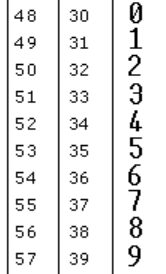

# 415. Add Strings

## 題目

[Add Strings - LeetCode](https://leetcode.com/problems/add-strings/)

## 思路

1. 這一題不能天真的直接轉成 int，在 LeetCode 跑測試時會直接給你一個很長的 string

   例如：`"123456789987654321123456789"`，相加的話會直接超出 int 範圍，而得到錯誤的結果

2. 因此要想別的做法，用 `ascii 轉 int`、`int 轉 ascii` 這樣去思考
3. 從 ASCII 表可以知道（如下圖）：

   - 十進位的 `48` → 代表 char 的 `'0'`

     十進位的 `49` → 代表 char 的 `'1'`

   - 想要把 ASCII 轉成數字，就要 `- '0'`

     想要把 數字轉成 ASCII，就要 `+ '0'`

     

   - 範例

   ```go
   // ascii to int
   result := '9' - '0' // 57 - 48 = 9
   fmt.Println(result) // 9

   // int to ascii
   result = 9 + '0'                    // 9 + 48 = 57
   fmt.Printf("%#v\n", string(result)) // "9"
   ```

## 解法

```go
package main

import (
	"fmt"
)

func main() {
	num1 := "456"
	num2 := "77"
	result := addStrings(num1, num2)
	fmt.Println(result)
}

func addStrings(num1 string, num2 string) string {
	// 取出最長的 len
	maxLength := 0
	if len(num1) >= len(num2) {
		maxLength = len(num1)
	} else {
		maxLength = len(num2)
	}

	sum := make([]byte, maxLength+1) // 長度 +1 因為相加後可能會進位
	carry := byte(0)                 // 進位的數字

	for i := 0; i < maxLength; i++ {
		a := byte(0)
		b := byte(0)

		if i < len(num1) {
			a = num1[len(num1)-i-1] - '0' // 從個位數開始取出每個數字
		}
		if i < len(num2) {
			b = num2[len(num2)-i-1] - '0'
		}

		s := a + b + carry
		carry = s / 10                 // ÷ 10 得到進位的數字，並在下一輪加上去
		sum[len(sum)-i-1] = s%10 + '0' // % 10 取出個位數，並 +'0' 轉成 ascii
	}

	if carry > 0 {
		sum[0] = '1' // 有進位就補上 1
	} else {
		sum = sum[1:] // 因為一開始 slice 長度有多預留 1，沒進位的話要拿掉
	}

	return string(sum)
}
```
